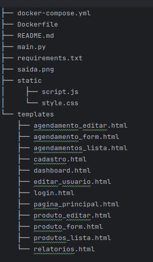

Os códigos apresentado descreve um sistema web de controle de estoque e agendamento de serviços. Ele é composto por uma API desenvolvida em FastAPI e um frontend em HTML, CSS e JavaScript. O sistema possui funcionalidades para gerenciar usuários, produtos e agendamentos, integrados com um banco de dados MySQL.

**Requisitos:**

**Para executar sua aplicação FastAPI, você precisará dos seguintes requisitos:**

1. **Python:**
- **Versão:** Python 3.7 ou superior (recomenda-se a versão mais recente). 
- **Motivo:** FastAPI utiliza recursos e sintaxe disponíveis apenas em versões recentes do Python. 

2. **Gerenciador de Pacotes pip:**
- **Motivo:** pip é usado para instalar as dependências do seu projeto. 
- **Observação:** Geralmente, o pip já vem instalado com o Python. 

3. **Ambiente Virtual (Recomendado):**
- **Ferramenta:** venv (módulo padrão do Python) ou virtualenv (pacote externo). 
- **Motivo:** Ambientes virtuais isolam as dependências do seu projeto, evitando conflitos com outras bibliotecas instaladas no sistema. 

4. **Dependências do Projeto (Listadas no requirements.txt):**
- Instalar as bibliotecas contidas em requirements.txt

5. **Banco de Dados MySQL:**
- **Motivo:** Sua aplicação utiliza um banco de dados MySQL para armazenar dados de usuários, agendamentos e produtos. 
- **Requisitos:** Um servidor MySQL em execução e as credenciais de acesso (host, usuário, senha, nome do banco de dados). 

6. **Navegador Web:**
- **Motivo:** Para acessar a interface web da sua aplicação e testar os endpoints da API. 

7. **Editor de Código (Opcional, mas Recomendado):**
- **Exemplos:** VS Code, PyCharm, Sublime Text. 
- **Motivo:** Para editar e gerenciar o código da sua aplicação. 

8. **Ferramentas de Teste de API (Opcional, mas Recomendado):**
- **Exemplos:** Postman, Insomnia, curl. 
- **Motivo:** Para testar os endpoints da API. 

**Passos para Configurar o Ambiente na maquina local:**

0. **Crie os diretorios e arquivos (Linux)**
mkdir -p app/static app/templates

touch app/docker-compose.yml
touch app/Dockerfile
touch app/main.py
touch app/README.md
touch app/requirements.txt

touch app/static/script.js
touch app/static/style.css

touch app/templates/agendamento_editar.html
touch app/templates/agendamento_form.html
touch app/templates/agendamentos_lista.html
touch app/templates/cadastro.html
touch app/templates/dashboard.html
touch app/templates/editar_usuario.html
touch app/templates/login.html
touch app/templates/pagina_principal.html
touch app/templates/produto_editar.html
touch app/templates/produto_form.html
touch app/templates/produtos_lista.html
touch app/templates/relatorios.html

**Verifique a Estrutura de diretorios e arquivos**

Comando:  tree app  (para verificar se a criação ficou igual a imagem abaixo)                       .

1. **Instale o Python:** Se você ainda não tem o Python instalado, baixe e 

instale a versão mais recente do site oficial do Python. 

2. **Crie um Ambiente Virtual:** 

- Navegue até o diretório do seu projeto no terminal. 
- Execute o comando python -m venv meu_env (ou virtualenv meu_env). 
- Ative o ambiente virtual: 
  - Linux: source meu_env/bin/activate 

3. **Instale as Dependências:** 

- Execute o comando pip install -r requirements.txt. 

4. **Configure o Banco de Dados MySQL:** 

- Certifique-se de que o servidor MySQL esteja em execução. 
- Crie um banco de dados chamado estoque (ou o nome que você definiu no main.py). 
- Atualize as credenciais de acesso no main.py. 

5. **Execute a Aplicação:** 

- Execute o comando uvicorn main:app --reload. 

6. **Acesse a Aplicação:** 

- Abra um navegador web e acesse http://127.0.0.1:8000.

**Passos para Configurar o Ambiente via Docker:**

**Passo 1: Atualizar o Sistema**
 sudo apt update && sudo apt upgrade -y

**Passo 2: Instalar Pacotes Necessários**
sudo apt install apt-transport-https ca-certificates curl software-properties-common -y

**Passo 3: Adicionar a Chave GPG do Docker**
curl -fsSL https://download.docker.com/linux/ubuntu/gpg | sudo gpg --dearmor -o /usr/share/keyrings/docker-archive-keyring.gpg

**Passo 4: Adicionar o Repositório do Docker**
echo "deb [arch=$(dpkg --print-architecture) signed-by=/usr/share/keyrings/docker-archive-keyring.gpg] https://download.docker.com/linux/ubuntu $(lsb_release -cs) stable" | sudo tee /etc/apt/sources.list.d/docker.list > /dev/null

**Passo 5: Instalar o Docker**
sudo apt update
sudo apt install docker-ce docker-ce-cli containerd.io -y

**Passo 6: Verificar a Instalação do Docker**
docker --version

**Passo 7: Habilitar e Iniciar o Docker**
sudo systemctl start docker
sudo systemctl enable docker

**Passo 8: Adicionar usuário ao grupo Docker (opcional, para rodar sem sudo)**
sudo usermod -aG docker $USER
newgrp docker

**Passo 9: Executar a aplicação**

- **Entrar no diretorio app**
    - cd app

- **Fazer o build da imagem**
    -  docker compose up --build
    -  aguardar a mensagem conforme abaixo:

http://0.0.0.0:8000 - url para acessa a aplicação (0.0.0.0 ip de onde o container está rodando)

0. **docker-compose.yml | Dockerfile | README.md:**

**docker-compose.yml**
- **Função:** 
    - Esse arquivo define e gerencia múltiplos contêineres Docker para a aplicação. Ele descreve quais serviços (como um banco de dados, backend, frontend) serão executados, quais imagens serão usadas e como os contêineres se comunicam.
  
**Dockerfile**
- **Função:** 
    - Define como a imagem Docker da aplicação será construída. Ele especifica a base da imagem, quais dependências instalar, como o código será adicionado ao contêiner e qual comando será executado ao iniciar o contêiner.
  
**README.md**
- **Função:** 
    - Um arquivo de documentação no formato Markdown (.md). Ele geralmente contém informações sobre o projeto, como descrição, instruções de instalação, como rodar a aplicação e exemplos de uso.

1. **main.py:**
- **Função:** 
  - Este é o arquivo principal da sua aplicação FastAPI. 
  - Ele contém todas as rotas da sua API, lógica de negócios, configurações do banco de dados e definições de modelos. 
  - Ele gerencia a criação de tabelas no banco de dados, define as rotas para login, cadastro de usuários, agendamentos, produtos e relatórios. 
  - Ele serve tanto a interface web quanto a API de consulta de agendamentos. 
  
- **Responsabilidades:** 
  - Definir as rotas da aplicação. 
  - Gerenciar o acesso ao banco de dados. 
  - Implementar a lógica de negócios da aplicação. 
  - Servir os templates HTML. 
  - Fornecer os endpoints da API. 

2. **static/:**
- **Função:** 
  - Este diretório contém os arquivos estáticos da sua aplicação, como CSS, JavaScript e imagens. 
  - Os arquivos estáticos são servidos diretamente pelo servidor web. 
  
- **Arquivos:** 
  - style.css: Arquivo CSS com os estilos da aplicação. 
  - script.js: Arquivo JavaScript com a lógica do frontend. 
  
- **Responsabilidades:** 
  - Definir a aparência e o comportamento das páginas web. 

3. **templates/:**
- **Função:** 
  - Este diretório contém os templates HTML da sua aplicação. 
  - Os templates são usados para renderizar as páginas web da sua aplicação. 
  - Eles usam a engine de templates Jinja2 para inserir dados dinâmicos nas páginas. 
  
- **Arquivos:** 
  - pagina_principal.html: Página principal da aplicação. 
  - login.html: Página de login. 
  - cadastro.html: Página de cadastro de usuários. 
  - dashboard.html: Página de dashboard com a lista de usuários. 
  - editar_usuario.html: Página para editar um usuário. 
  - agendamentos_lista.html: Página com a lista de agendamentos. 
  - agendamento_form.html: Página para criar um novo agendamento. 
  - agendamento_editar.html: Página para editar um agendamento. 
  - produtos_lista.html: Página com a lista de produtos. 
  - produto_form.html: Página para criar um novo produto. 
  - produto_editar.html: Página para editar um produto. 
  - relatorios.html: Página com os relatórios. 
  
- **Responsabilidades:** 
  - Definir a estrutura e o layout das páginas web. 
  - Exibir dados dinâmicos da aplicação. 

4. **requirements.txt:**
- **Função:** 
  - Este arquivo lista todas as dependências Python do seu projeto, juntamente com suas versões. 
  - Ele é usado para recriar o ambiente virtual do projeto em outras máquinas. 
  
- **Responsabilidades:** 
  - Listar as dependências do projeto.
